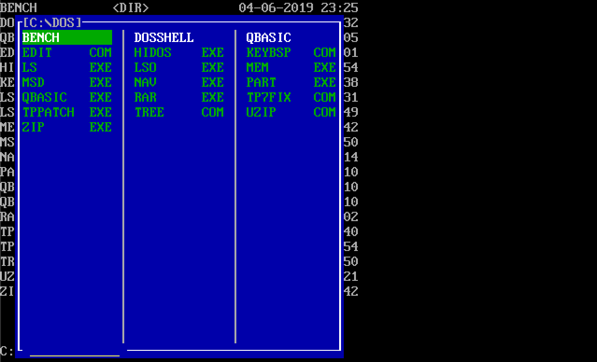

# NAV-for-dos
NAV is a folder navigation program for DOS

|  |
|:--:|
| *Navigation screen.* |

It uses a simple UI to show folders and executables, can navigate with arrows, select with intro key and go back with backspace key (like in windows explorer) and it also have a search functionailty, start typing and the program select the typed name, below the typed search will be shown.

You can execute .exe .com and .bat files and an upcoming feature is the ability to read and view text files.

A compiler option for low ram usage is present for old computers.
